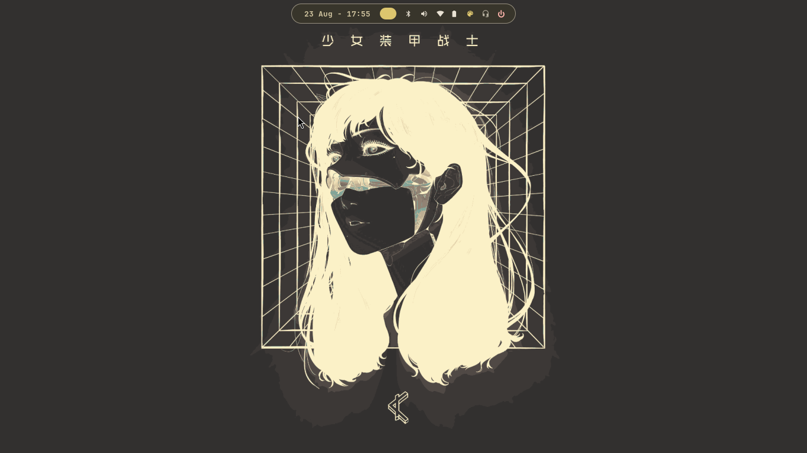
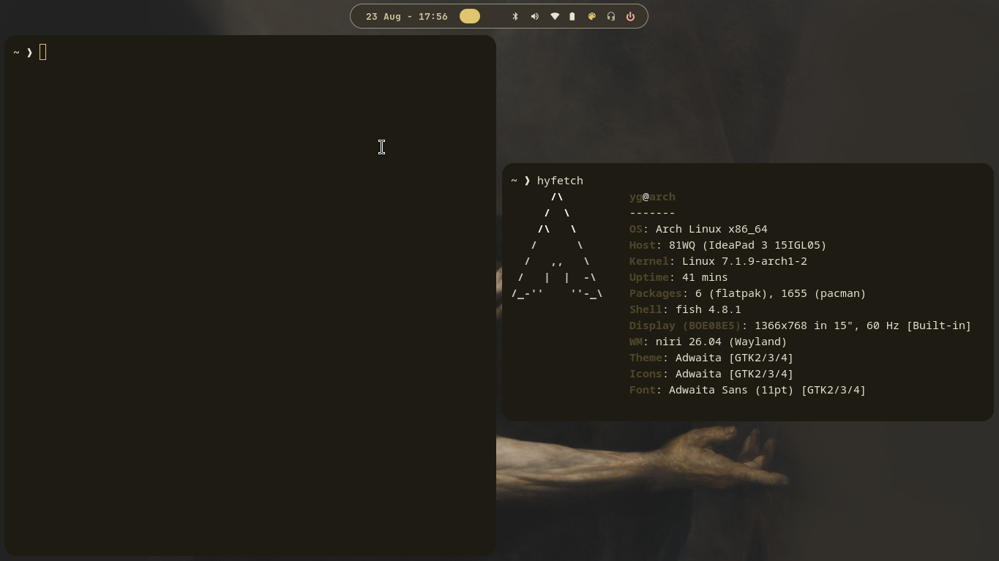

# ❄️ Low-Spec Niri Rice

<div align="center">
  
  
  
  
</div>

<p align="center">
  <b>A lightweight scrollable-tiling niri configuration optimized for low-end hardware.</b><br>
  <i>Wallpaper-driven Material You theming — every app recolors itself in under a second.</i>
</p>

<div align="center">
  <a href="#-gallery">Gallery</a> •
  <a href="#-highlights">Highlights</a> •
  <a href="#-installation">Installation</a> •
  <a href="#-keybinds">Keybinds</a> •
  <a href="#-core-stack">Core Stack</a> •
  <a href="#-credits--support">Credits</a>
</div>

---

## ✨ Showcase ✨



### 🖼️ Gallery
| Gruvbox Mood | Wallpaper-Retinted Theme |
| :---: | :---: |
|  |  |

| Real Idle Memory | Low-Spec Hardware |
| :---: | :---: |
|  |  |

---

## 🚀 Highlights

- 🎨 **Dynamic Theming**: Powered by **Matugen** — changing the wallpaper retints waybar, fuzzel, mako, kitty, GTK apps and niri borders instantly.
- 🏝️ **Dynamic Island Waybar**: A single floating pill bar (+14 more layouts bundled: pill, island, mac, retro…), fully ported to niri.
- 🛠️ **Theme-Aware Menus**: Fuzzel-powered wifi manager, bluetooth manager, power menu and a macOS-style control center.
- 📦 **Organized Wallpapers**: `rice-classify-wallpapers` sorts your collection into color pools (gruvbox / nord / tokyo…) without moving a single file.
- ⚡ **Low-Spec Optimized**: **~230 MB idle**, native-Wayland everything (no Xwayland), no accessibility bus, no redundant portals.

---

> [!IMPORTANT]
> **Read this First**
> This setup targets Arch Linux / EndeavourOS running the **niri session**. Dependencies are checked by `install.sh` — install any missing packages listed.

> [!CAUTION]
> **Backup your system**
> Back up your existing `~/.config` before installing. The installer symlinks configs into place; manual safety is recommended.

---

## 📦 Installation

### 🆕 Prerequisites
- **Compositor**: `niri` session enabled
- **Core tools**: `waybar swaybg swayidle mako fuzzel matugen cliphist wl-clipboard kitty brightnessctl playerctl pamixer wlogout swaylock`

### 🚀 Quick Install
```bash
git clone --depth=1 https://github.com/okyashgajjar/Low-Spec-Niri-Dotfiles.git
cd Low-Spec-Niri-Dotfiles
chmod +x install.sh
./install.sh
systemctl --user enable niri.service
```
Then relogin into the niri session.

### 🖼️ Your own wallpapers
Point the classifier at your collection (edit `SRC` inside the script):
```bash
rice-classify-wallpapers
```
Wallpapers are never moved or deleted — themed folders are symlink pools only.

---

## ⌨️ Keybinds

| Keybind | Action |
| :--- | :--- |
| `SUPER + Return` / `SUPER + T` | Terminal (kitty) |
| `SUPER + Space` | App Launcher (Fuzzel) |
| `ALT + Space` | Run Command |
| `SUPER + Q` | Kill Active Window |
| `SUPER + Comma` | **Control Center** |
| `SUPER + CTRL + T` | **Cycle Theme Pool** |
| `SUPER + CTRL + W` | Next Wallpaper (retints desktop) |
| `SUPER + Y` | Wallpaper Picker |
| `SUPER + X` | Power Menu |
| `SUPER + V` | Clipboard History |
| `SUPER + ALT + L` | Lock Screen |

Full list in [`config/niri/config.kdl`](config/niri/config.kdl).

---

## 🛠️ Core Stack
| Component | Program |
| :--- | :--- |
| **Window Manager** | `niri` |
| **Status Bar** | `Waybar` (Dynamic Island) |
| **Theming** | `Matugen` (Material You from wallpaper) |
| **Launcher / Menus** | `Fuzzel` |
| **Notifications** | `Mako` |
| **Wallpaper** | `swaybg` |
| **Terminal** | `kitty` |
| **Idle / Lock** | `swayidle` / `swaylock` |

---

## 📒 Final Notes
*   **Performance**: Everything renders native Wayland — no Xwayland is ever spawned. Bar modules poll at 4s+ intervals so idle CPU stays near zero.
*   **Fonts**: The default font is **JetBrainsMono Nerd Font**.
*   **Updating**: tweak configs live in `$HOME`, then run `./sync.sh && git commit -am "tweak"`.

### 🤝 Credits & Support
- **niri**: For the amazing scrollable tiling compositor.
- **Matugen**: For the Material You theming engine.
- **Waybar layouts**: ported from my [low-spec hyprland dotfiles](https://github.com/okyashgajjar/low-sepecs-hyprland-dotfiles).
- **Support**: A Star 🌟 on this repo would be appreciated!

---
*Developed with love for low-spec warriors.*
